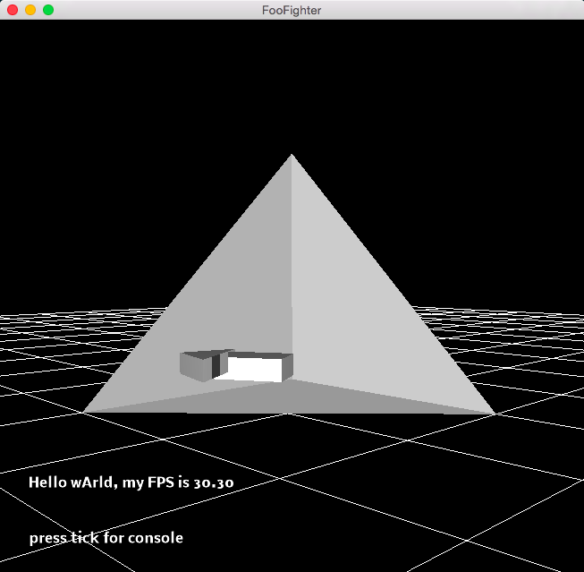
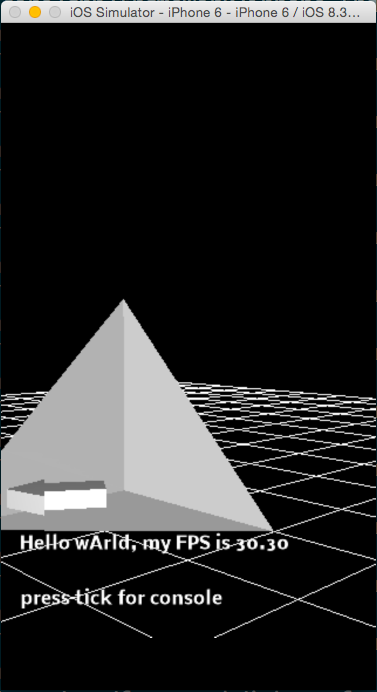
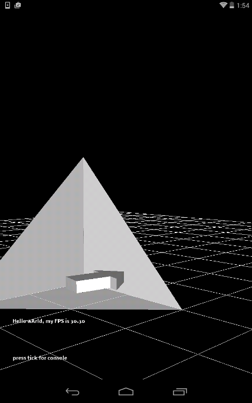

## How to setup a new LFL project on a MacBook and run 3 platforms from same directory.

First go to https://github.com/new and create a repository. 
I'll use https://github.com/zerothat/FooFighter.  Substitue your own repository for it below.
Then open a shell and:

        git clone https://github.com/zerothat/FooFighter
        cd FooFighter
        git submodule add https://github.com/LucidFusionLabs/core
        git submodule update --init --recursive
        ./core/new_app_template/clone.sh com.zerothat FooFighter foo
        cp core/CMake/TemplateRootCMakeLists.txt CMakeLists.txt
        git add CMakeLists.txt foo
        echo "add_subdirectory(foo)" >> CMakeLists.txt

I modify "Hello world" in foo/foo.cpp to "Hello wArld".
Now let's go through the build instructions from https://github.com/LucidFusionLabs/core for each platform.
First OSX, which takes longest because it includes more imports by default, e.g. ffmpeg and OpenCV.

        mkdir osx
        cd osx
        cmake ..
        cd foo
        make
        make foo_run

I take a screenshot with cmd+shift+4.

Next iOS simulator because no key signing setup is needed.

        cd ../.. back to FooFighter root
        mkdir iphonesim
        cd iphonesim
        cmake -DCMAKE_TOOLCHAIN_FILE=../core/CMake/iPhoneToolchain.cmake -DLFL_IPHONESIM=1 ..
        cd foo
        make
        make foo_run

I take another screenshot with cmd+shift+4.

Last android.  I plug my Nexus7 in and:

        cd ../.. back to FooFighter root
        mkdir android
        cd android
        cmake -DCMAKE_TOOLCHAIN_FILE=../core/CMake/AndroidToolchain.cmake ..
        cd foo
        make
        make foo_debug

I take another screenshot by holding the sleep/wake and volume-down buttons until the screen flashes.

## Going Further

Follow the example of other apps:

* https://github.com/LucidFusionLabs/chess/blob/master/chess.cpp
* https://github.com/LucidFusionLabs/editor/blob/master/editor.cpp
* https://github.com/LucidFusionLabs/term/blob/master/term.cpp
* https://github.com/LucidFusionLabs/browser/blob/master/browser.cpp
* https://github.com/LucidFusionLabs/quake/blob/master/quake.cpp
* https://github.com/LucidFusionLabs/spaceball/blob/master/spaceball.cpp

## File Manifest

* CMakeLists.txt:                        Build rules
* new_app_template.cpp:                  App source code
* assets/:                               All models, multimedia, databases, etc here  
* assets/icon.ico:                       Windows icon file
* assets/icon.icns:                      Mac icon file
* assets/icon.bmp:                       32x32 Bitmap icon file

        Icon converter: http://iconverticons.com/

* -android/res/drawable-hdpi/icon.png:   72x72 Android icon
* -android/res/drawable-mdpi/icon.png:   48x48 Android icon
* -android/res/drawable-ldpi/icon.png:   36x36 Android icon
* -iphone/Images/Icon.png:               57x57 iPhone icon

        Png resizer http://images.my-addr.com/resize_png_online_tool-free_png_resizer_for_web.php

* -iphone/Images/Default.png:            320x480 iPhone splash screen
* -iphone/Images/Default@2x.png:         640x960 iPad splash screen
* Android splash screens:

        cp ../spaceball-iphone/Images/Default\@2x.png res/drawable-hdpi/splash.png
        cp ../spaceball-iphone/Images/Default\@2x.png res/drawable-xhdpi/splash.png
        cp ../spaceball-iphone/Images/Default.png res/drawable-ldpi/splash.png
        cp ../spaceball-iphone/Images/Default.png res/drawable-mdpi/splash.png

* new_app_template.nsi:                  Windows Nullsoft Installer config
* new_app_template-android/:             Android Eclipse linker and installer config
* new_app_template-iphone/:              iPhone XCode binary signer config

* iphone-Info.plist:                     iPhone properties list
* mac-Info.plist:                        OSX properties list
